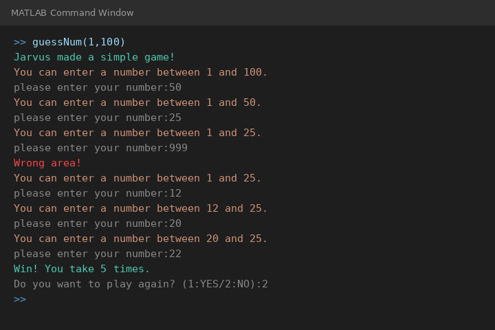

# 🎮 MATLAB 猜數字遊戲 / Number Guessing Game

一個用 MATLAB 實作的互動式猜數字遊戲，每次猜測後會自動縮小範圍，幫助你更快找到答案！

## 🚀 使用方式

```matlab
guessNum(minBound, maxBound)
```

**範例：**
```matlab
guessNum(1, 100)
```

## 🎯 遊戲規則

1. 電腦在 `minBound` 到 `maxBound` 之間隨機產生一個答案
2. 玩家輸入猜測的數字
3. 若輸入超出目前範圍，顯示 `Wrong area!` 並重新輸入
4. 每次猜測後，範圍會自動縮小（猜太小 → 下界提高；猜太大 → 上界降低）
5. 猜中後顯示總猜測次數，並詢問是否再玩一次

## 📋 功能特色

| 功能 | 說明 |
|------|------|
| 動態縮小範圍 | 每次猜測後自動更新上下界 |
| 範圍檢查 | 輸入超出範圍顯示 `Wrong area!` |
| 次數統計 | 猜中後顯示 `Win! You take N times.` |
| 再玩一次 | 輸入 `1:YES / 2:NO` 選擇是否繼續 |
| 隨機產生 | 使用 `randperm` 產生不重複隨機數 |

## 🖥️ 執行截圖



## 📁 檔案說明

- `guessNum.m` - 主程式（副函式）
- `screenshot.png` - 遊玩截圖

## 🛠️ 環境需求

- MATLAB R2016b 或以上版本

## 📚 課程來源

本程式為 [MATLAB 音訊處理入門 - 專屬語音助理](https://hahow.in/courses/598b01e6891876070047423a) 課程練習作業。
